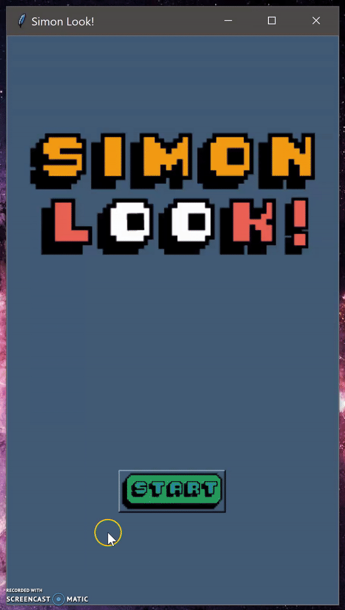

# SimonLook-ReactNative
Simon Look! is the a game that has the same manner to the classic game “Simon Says” but instead of light, we will be using images. The objective of this game is to remember the sequence of the images that will be displayed, and the player are able to reiterate the whole sequence. This will test the player’s memory, and how long the player can focus. This was originally written in Python. I am trying to rewrite it in React-Native (Application).

Simon Look! in Python: https://github.com/beytanii/SimonLook-Python

Demo video: 

Simon Look! Demo in React:

